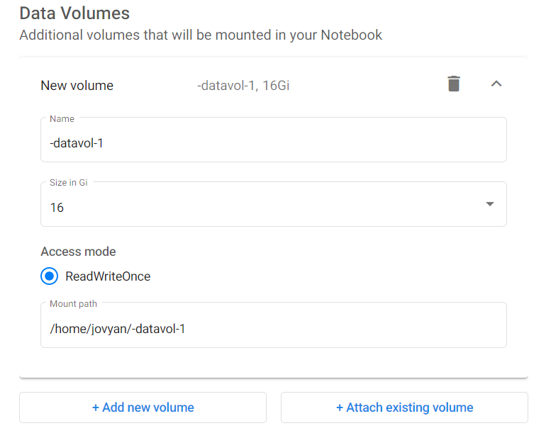
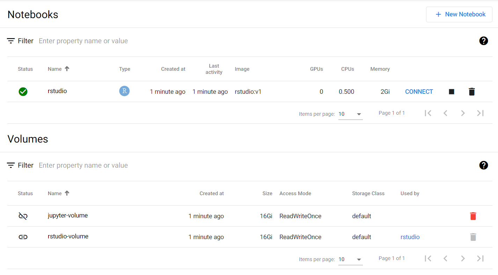

# Overview

Disks are the familiar hard drive style file systems you're used to, provided to
you from fast solid state drives (SSDs)!

# Setup

When creating your notebook server, you request disks by adding Data Volumes to
your notebook server (pictured below, with `Type = New`). They are automatically
mounted at the directory (`Mount Point`) you choose, and serve as a simple and
reliable way to preserve data attached to a Notebook Server.

<!--prettier-ignore-->
??? warning "You pay for all disks you own, whether they're attached to a Notebook Server or not"
    As soon as you create a disk, you're [paying](#pricing) for it until it is [deleted](#deleting-disk-storage), even if it's original Notebook Server is deleted.  See [Deleting Disk Storage](#deleting-disk-storage) for more info

# Once you've got the basics ...

When you delete your Notebook Server, your disks **are not deleted**. This let's
you reuse that same disk (with all its contents) on a new Notebook Server later
(as shown above with `Type = Existing` and the `Name` set to the volume you want
to reuse). If you're done with the disk and it's contents,
[delete it](#deleting-disk-storage).

## Deleting Disk Storage

To see your disks, check the Notebook Volumes section of the Notebook Server
page (shown below). You can delete any unattached disk (orange icon on the left)
by clicking the trash can icon.

## Pricing

<!--prettier-ignore-->
??? info "Pricing models are tentative and may change"
    As of writing, pricing is covered by the platform for initial users.  This guidance explains how things are expected to be priced priced in future, but this may change.

When mounting a disk, you get an
[Azure Managed Disk](https://azure.microsoft.com/en-us/pricing/details/managed-disks/).
The **Premium SSD Managed Disks** pricing shows the cost per disk based on size.
Note that you pay for the size of disk requested, not the amount of space you
are currently using.

<!--prettier-ignore-->
??? info "Tips to minimize costs"
    As disks can be attached to a Notebook Server and reused, a typical usage pattern could be:

    * At 9AM, create a Notebook Server (request 2CPU/8GB RAM and a 32GB attached
      disk)
    * Do work throughout the day, saving results to the attached disk
    * At 5PM, shut down your Notebook Server to avoid paying for it overnight
      * NOTE: The attached disk **is not destroyed** by this action
    * At 9AM the next day, create a new Notebook Server and **attach your existing
      disk**
    * Continue your work...

    This keeps all your work safe without paying for the computer when you're not using it
