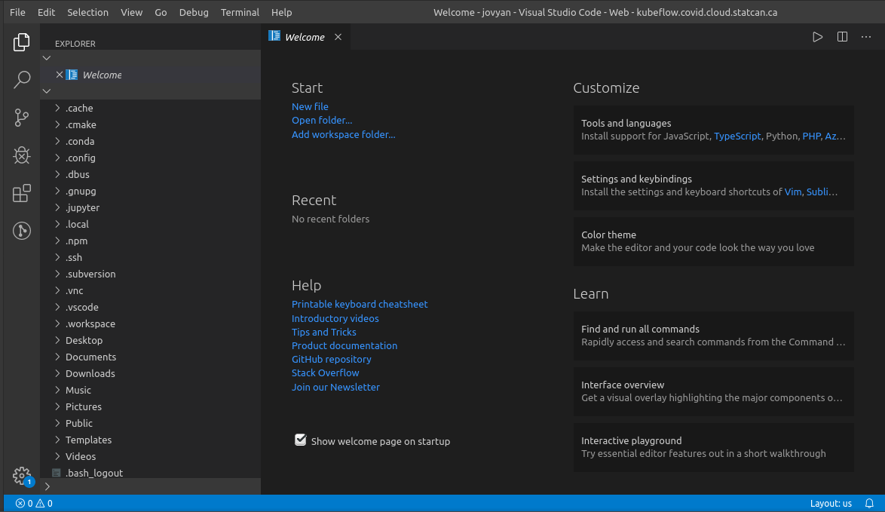

# Bureau Virtuel

# Qu'est-ce qu'un Bureau Virtuel?

Le bureau à distance offre une expérience de bureau Ubuntu avec une interface
graphique dans le navigateur, ainsi qu'un accès rapide aux outils de support. Le
système d'exploitation est [**Ubuntu**](https://ubuntu.com/about) **18.04** avec
l'environnement de bureau [**XFCE**](https://www.xfce.org/about).

## Versions

Deux versions du Bureau Virtuel sont disponibles. _R_ comprend R et RStudio.
Geomatics étend _R_ avec QGIS et diverses bibliothèques de support. Vous pouvez
personnaliser votre espace de travail en fonction de vos besoins et de vos
préférences.

## Personnalisation

_pip_, _conda_, _npm_ et _yarn_ sont disponibles pour installer divers paquets.

# Accéder au Bureau Virtuel

Pour lancer le Bureau Virtuel ou l'un de ses outils de support, créez un serveur
bloc-notes dans [Kubeflow](./Kubeflow.md) et sélectionnez l'une des versions
disponibles dans la liste des images. Ensuite, cliquez sur `Connecter` pour
accéder au Bureau Virtuel.

Un _Bureau Virtuel_ vous permet d'accéder à l'interface graphique du bureau via
une session noVNC. Cliquez sur le '<' sur le côté gauche de l'écran pour ouvrir
un panneau avec des options telles qu'un plein écran et l'accès au
presse-papiers.

# Outils dans le Navigateur

## VS Code

Visual Studio Code est un éditeur de code source léger mais puissant. Il est
livré avec un support intégré pour JavaScript, TypeScript et Node.js et possède
un riche écosystème d'extensions pour plusieurs langages (tels que C++, C#,
Java, Python, PHP, Go).

# Notes de bas de page

Bureau Virtuel est basé sur
[ml-tooling/ml-workspace](https://github.com/ml-tooling/ml-workspace).
