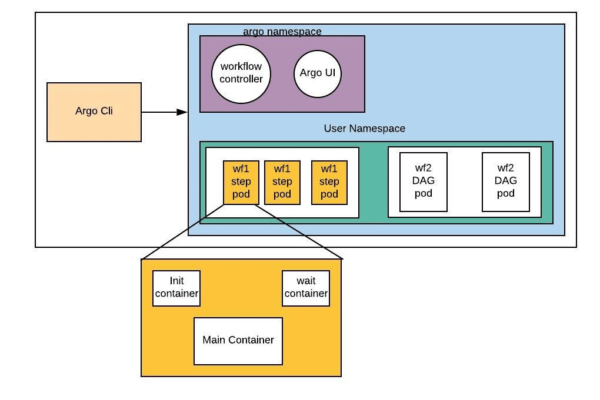

## Flux de travail Argo


**[Flux de travail Argo](https://argoproj.github.io/argo-workflows/)** est un moteur de flux de travail à logiciel libre natif de conteneur pour orchestrer des tâches parallèles sur Kubernetes. Les flux de travails Argo sont implémentés en tant que Kubernetes CRD (Custom Resource Definition). Il est particulièrement adapté aux flux de travail de science des données et aux flux de travail d’apprentissage automatique.

La documentation complète peut être trouvée [ici](https://argoproj.github.io/argo-workflows/walk-through/).

Les flux de travails Argo ont les avantages suivants:

- Les tâches de workflow peuvent être définies sous forme de scripts (ex. Python) ou être conteneurisées (ex. Docker).
- Des flux de travail complexes peuvent être modélisés à l'aide de graphes acycliques dirigés (DAG) pour capturer les chaînes de dépendance.
- Les tâches indépendantes peuvent être exécutées en parallèle avec une granularité jusqu'au niveau de mise en œuvre, réduisant ainsi les charges de tâches chronophages.
- Agnositique de la plateforme Kubernetes, ce qui signifie que votre travail est très portable.

Avec les flux de travails Argo, vous pouvez facilement créer des flux de travails qui intègrent des tâches telles que des constructions et des déploiements automatisés, le prétraitement des données, la formation de modèles et le déploiement de modèles, le tout dans un environnement Cloud Native Kubernetes.

<!-- prettier-ignore -->
!!! info ""
    <center>
    [](https://argoproj.github.io/argo-workflows/)
    <h3>Flux de travail Argo</h3>
    </center>

Vous trouverez ci-dessous un exemple de cas d'utilisation de flux de travail Argo, dans lequel nous formons un modèle d'apprentissage automatique à l'aide des flux de travail Argo sur AAW.

#### 1. Écrivez un script pour entraîner votre modèle

Voici un exemple de script qui entraîne un modèle de régression logistique sur l'ensemble de données iris. N'oubliez pas de consulter le code de chaque langue ci-dessous.

=== "Python"

    ``` python title="train.py" linenums="1"
    #!/usr/bin/env python

    # Importer les bibliothèques nécessaires
    import argparse
    import pandas as pd
    from sklearn.datasets import load_iris
    from sklearn.linear_model import LogisticRegression
    from sklearn.model_selection import train_test_split
    from sklearn.metrics import accuracy_score
    import joblib

    # Analyser les arguments d'entrée
    parser = argparse.ArgumentParser(description="Train logistic regression model on iris dataset.")
    parser.add_argument("--input", default="iris.csv", help="Path to input dataset file.")
    parser.add_argument("--output", default="model.pkl", help="Path to output model file.")
    args = parser.parse_args()

    # Charger l'ensemble de données d'iris
    data = load_iris()
    X, y = data.data, data.target

    # Divisez les données en ensembles d'entraînement et de test
    X_train, X_test, y_train, y_test = train_test_split(X, y, test_size=0.2, random_state=42)

    # Entraîner un modèle de régression logistique
    clf = LogisticRegression(random_state=42)
    clf.fit(X_train, y_train)

    # Évaluer le modèle sur l'ensemble de test
    y_pred = clf.predict(X_test)
    accuracy = accuracy_score(y_test, y_pred)
    print("Accuracy:", accuracy)

    # Enregistrer le modèle dans un fichier
    joblib.dump(clf, args.output)
    ```

=== "R"

    ``` r title="train.R" linenums="1"
    #!/usr/bin/env Rscript

    # Importer les bibliothèques nécessaires
    library(caret)

    # Copier les arguments d'entrée
    args <- commandArgs(trailingOnly = TRUE)
    input_file <- ifelse(length(args) > 0, args[1], "iris.csv")
    output_file <- ifelse(length(args) > 1, args[2], "model.rds")

    # Charger l'ensemble de données d'iris
    data(iris)
    X <- iris[, 1:4]
    y <- iris[, 5]

    # Divisez les données en ensembles d'entraînement et de test
    set.seed(42)
    train_index <- createDataPartition(y, p = 0.8, list = FALSE)
    X_train <- X[train_index, ]
    y_train <- y[train_index]
    X_test <- X[-train_index, ]
    y_test <- y[-train_index]

    # Entraîner un modèle de régression logistique
    clf <- train(x = X_train, y = y_train, method = "glm")

    # Évaluer le modèle sur l'ensemble de test
    y_pred <- predict(clf, newdata = X_test)
    accuracy <- confusionMatrix(y_pred, y_test)$overall["Accuracy"]
    print(paste0("Accuracy: ", accuracy))

    # Enregistrer le modèle dans un fichier
    saveRDS(clf, output_file)
    ```
#### 2. Écrivez un Dockerfile pour exécuter votre code

Vous aurez besoin d'un Dockerfile qui inclut toutes les dépendances nécessaires pour entraîner votre modèle d'apprentissage automatique. Cela pourrait inclure:

- des paquets comme
   - `scikit-learn`, `pandas` ou `numpy` si vous utilisez `Python`
   - `caret`, `janitor` et `tidyverse` si vous utilisez `R`
- vos propres bibliothèques ou scripts personnalisés
- le code de votre modèle d'apprentissage automatique sous la forme d'un script [comme dans l'exemple ci-dessus](#1-ecrivez-un-script-pour-entrainer-votre-modele).

Utilisez le `Dockerfile` suivant comme point de départ pour vos projets `R` et `Python`.

=== "Python"

    ``` docker title="Dockerfile" linenums="1"
    FROM python:3.8-slim-buster

    # Installez toutes les dépendances nécessaires
    RUN pip install --no-cache-dir scikit-learn pandas numpy

    # Définir le répertoire de travail
    WORKDIR /app

    # Copier le code dans le conteneur
    COPY train.py .

    # Définir le point d'entrée
    ENTRYPOINT ["python", "train.py"]
    ```

=== "R"
    ``` docker title="Dockerfile" linenums="1"
    FROM rocker/r-base:latest

    RUN apt-get update && apt-get install -y --no-install-recommends \
        libssl-dev \
        libcurl4-openssl-dev \
        libxml2-dev \
        && apt-get clean \
        && rm -rf /var/lib/apt/lists/*

    RUN R -e 'install.packages(c("caret", "janitor", "tidyverse"))'

    COPY train.R /app/train.R

    WORKDIR /app

    ENTRYPOINT ["Rscript", "train.R"]
    ```

#### 3. Écrivez votre flux de travail en YAML

YAML est encore un autre langage de balisage et vous devrez écrire les étapes de votre pipeline de formation dans un fichier YAML de flux de travails Argo. Ce fichier doit inclure une référence au Dockerfile que vous avez créé à l'[Étape 1](#2-ecrivez-un-dockerfile-pour-executer-votre-code), ainsi que toutes les données d'entrée et de sortie avec lesquelles vous travaillerez.

Voici un exemple de fichier YAML pour un pipeline d'apprentissage automatique simple qui entraîne un modèle de régression logistique sur l'ensemble de données iris. La seule vraie différence entre les versions `Python` et `R` est la commande `command: ["python", "train.py"]` vs `command: ["Rscript", "train.R"]` et le les modèles sont stockés dans différents formats, `pkl` pour `python` et `rds` pour `R`.

Le fichier YAML définit une seule étape appelée `train` qui exécute un script appelé `train.py` ou `train.R` dans l'image Docker `machine-learning:v1`. Le script prend un fichier d'ensemble de données d'entrée, spécifié par un paramètre appelé `dataset`, et génère un fichier de modèle entraîné vers un artefact de sortie appelé `model.pkl` ou `model.rds` selon le langage utilisé.

=== "Python"
    ``` yaml title="workflow.yaml" linenums="1"
    apiVersion: argoproj.io/v1alpha1
    kind: Workflow
    metadata:
    generateName: ml-pipeline-
    spec:
    entrypoint: train
    templates:
    - name: train
        container:
        image: machine-learning:v1
        command: ["python", "train.py"]
        args: ["--input", "{{inputs.parameters.dataset}}", "--output", "{{outputs.artifacts.model}}"]
        inputs:
        parameters:
        - name: dataset
            default: "iris.csv"
        outputs:
        artifacts:
        - name: model
            path: /output/model.pkl
    ```
=== "R"
    ``` yaml title="workflow.yaml" linenums="1"
    apiVersion: argoproj.io/v1alpha1
    kind: Workflow
    metadata:
    generateName: ml-pipeline-
    spec:
    entrypoint: train
    templates:
    - name: train
        container:
        image: machine-learning:v1
        command: ["Rscript", "train.R"]
        args: ["--input", "{{inputs.parameters.dataset}}", "--output", "{{outputs.artifacts.model}}"]
        inputs:
        parameters:
        - name: dataset
            default: "iris.csv"
        outputs:
        artifacts:
        - name: model
            path: /output/model.rds
    ```

#### 4. Soumettez le flux de travail à l'aide de l'entrée de ligne de commande(CLI) du flux de travail Argo

Pour exécuter le flux de travail ci-dessus, vous devrez d'abord envoyer le Dockerfile vers notre registre de conteneurs, puis soumettre le fichier YAML à l'aide de la commande `argo submit`. Une fois le pipeline terminé, vous pouvez récupérer le fichier de modèle entraîné en téléchargeant l'artefact de sortie à partir de la commande `argo logs`.

``` bash title="Terminal"
$ argo submit workflow.yaml # soumettre une spécification de flux de travail à Kubernetes
```

Il est également possible de soumettre des flux de travail argo à partir des flux de travail à l'aide de SDK et d'appels API (c'est juste un autre service Web !). Voir cette [section](#exemples-utilisant-des-sdk-bases-sur-flux-de-travail-argo).

#### 5. Surveillez le pipeline à l'aide de la CLI du flux de travail Argo

Pendant l'exécution du pipeline, vous pouvez surveiller sa progression à l'aide de la CLI de flux de travail Argo. Cela vous montrera quelles étapes se sont terminées avec succès et lesquelles sont toujours en cours. Vous trouverez ci-dessous quelques commandes utiles. Pour plus d'informations sur la CLI des flux de travail Argo, veuillez consulter [la documentation officielle de la CLI de flux de travail Argo](https://argoproj.github.io/argo-workflows/walk-through/argo-cli/) .

``` bash title="Terminal"
$ argo list                       # lister les flux de travail actuels
$ argo get workflow-xxx           # obtenir des informations sur un flux de travail spécifique
$ argo logs workflow-xxx          # imprimer les journaux d'un flux de travail
$ argo delete workflow-xxx        # suprimer un flux de travail

```

#### 6. Récupérer le modèle entraîné

Une fois la pipeline terminé, vous pouvez récupérer les données de sortie à l'aide de la commande argo logs ou en affichant les artefacts de sortie à l'aide de la CLI, c'est-à-dire accéder au répertoire que vous avez spécifié dans votre script et localiser le fichier `model.pkl` ou `model.rds`. L'extrait de code suivant, extrait du [script de formation ci-dessus](#1-ecrivez-un-script-pour-entrainer-votre-modele), indique au langage de programmation respectif où enregistrer le modèle entraîné.

=== "Python"

    ``` python title="Saving Output Data" linenums="1"
    #!/usr/bin/env python
    
    parser.add_argument("--output", default="model.pkl", help="Path to output model file.")
    
    # Enregistrer le modèle dans un fichier
    joblib.dump(clf, args.output)
    ```

=== "R"

    ``` r title="Saving Output Data" linenums="1"
    #!/usr/bin/env Rscript
    
    output_file <- ifelse(length(args) > 1, args[2], "model.rds")
    
    # Enregistrer le modèle dans un fichier
    saveRDS(clf, output_file)
    ```

### Exemples utilisant des SDK basés sur flux de travail Argo

Argo prend en charge les [bibliothèques client](https://argoproj.github.io/argo-workflows/client-libraries/), générées automatiquement et gérées par la communauté, qui incluent les SDK Java et Python.

Si vous préférez utiliser un cadres de niveau supérieur, alors `Couler` et `Hera` sont des alternatives bien adaptées. Ces cadress rendent la création et la gestion de flux de travail complexes plus accessibles à un public plus large.

#### Hera

Hera vise à simplifier le processus de création et de soumission de flux de travail en éliminant de nombreux détails techniques via une interface de programmation d'application simple. Il utilise également un ensemble cohérent de terminologie et de concepts qui s'alignent sur les flux de travail Argo, permettant aux utilisateurs d'apprendre et d'utiliser plus facilement les deux outils ensemble.

#### Couler

Couler fournit une interface de programmation d'applications simple et unifiée pour définir des flux de travail à l'aide d'un style de programmation impératif. Il construit également automatiquement des graphiques acycliques dirigés (DAG) pour les flux de travail, ce qui peut contribuer à simplifier le processus de création et de gestion de ceux-ci.

=== "Couler"
    ``` py title="couler.py" linenums="1"
    #!/usr/bin/env python

    # Préparez votre système
    !pip config --user set global.index-url https://jfrog.aaw.cloud.statcan.ca/artifactory/api/pypi/pypi-remote/simple
    !python3 -m pip install git+https://github.com/couler-proj/couler --ignore-installed

    # Définir une variable globale pour plus de commodité
    NAMESPACE = "<your-namespace>"

    # Importer les packages nécessaires
    import json
    import random

    import couler.argo as couler
    from couler.argo_submitter import ArgoSubmitter


    # Définir les étapes (fonctions) utilisées dans le workflow
    def random_code():
        import random
        res = "heads" if random.randint(0, 1) == 0 else "tails"
        print(res)


    def flip_coin():
        return couler.run_script(
            image="k8scc01covidacr.azurecr.io/ubuntu",
            source=random_code
        )


    def heads():
        return couler.run_container(
            image="k8scc01covidacr.azurecr.io/ubuntu",
            command=["sh", "-c", 'echo "it was heads"']
        )


    def tails():
        return couler.run_container(
            image="k8scc01covidacr.azurecr.io/ubuntu",
            command=["sh", "-c", 'echo "it was tails"']
        )


    result = flip_coin()

    couler.when(couler.equal(result, "heads"), lambda: heads())
    couler.when(couler.equal(result, "tails"), lambda: tails())

    submitter = ArgoSubmitter(namespace="NAMESPACE")
    result = couler.run(submitter=submitter)

    print(json.dumps(result, indent=2))
    ```
=== "Hera"
    ``` py title="hera.py" linenums="1"
    #!/usr/bin/env python

    # Préparez votre système
    !pip config --user set global.index-url https://jfrog.aaw.cloud.statcan.ca/artifactory/api/pypi/pypi-remote/simple
    !pip install hera-workflows
    
    # Importer les packages nécessaires
    import hera
    from hera import Task, Workflow

    # Configurer Hera
    hera.global_config.GlobalConfig.token = "<your-token>"
    hera.global_config.GlobalConfig.host = "https://argo-workflows.aaw-dev.cloud.statcan.ca:443"
    hera.global_config.GlobalConfig.namespace = "<your-namespace>"
    hera.global_config.GlobalConfig.service_account_name = "<your-account-name>"


    # Définir les étapes (fonctions) utilisées dans le workflow
    def random_code():
        res = "heads" if random.randint(0, 1) == 0 else "tails"
        print(res)


    def heads():
        print("it was heads")


    def tails():
        print("it was tails")

    # Définir le flux de travail
    with Workflow("coin-flip") as w:
        r = Task("r", random_code)
        h = Task("h", heads)
        t = Task("t", tails)

        h.on_other_result(r, "heads")
        t.on_other_result(r, "tails")

    # Exécuter le flux de travail
    w.create()
    ```

### Ressources supplémentaires pour les flux de travail Argo

Des exemples de flux de travail Argo peuvent être trouvés dans les référentiels Github suivants :

- [Documentation des flux de travail Argo](https://argoproj.github.io/argo-workflows/)
- [Référence Argo CLI](https://argoproj.github.io/argo-workflows/walk-through/argo-cli/)
