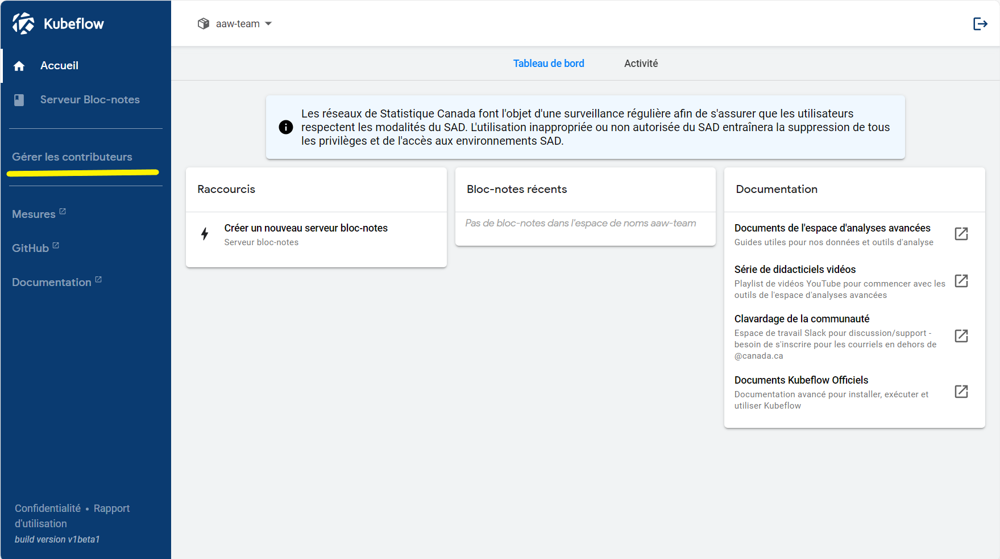

Il existe de nombreuses façons de collaborer sur la plateforme. Selon votre
situation,ce qu vous voulez partager et le nombre de personnes que vous
souhaitez partager avec. Les scénarios se décomposent en gros en ce que vous
voulez partager (**Données**, **Code**, ou **Environnements de calcul** (e.g.:
Partager les mêmes machines virtuelles)) et avec qui vous voulez le partager
(**Personne**, **Mon équipe**, ou **Tout le monde**). Cela conduit au tableau
d'options suivant:

|             |              **Privée**               |                          **Équipe**                          |     **StatCan**      |
| :---------: | :-----------------------------------: | :----------------------------------------------------------: | :------------------: |
|  **Code**   | GitLab/GitHub ou un dossier personnel |              GitLab/GitHub or dossier d'équipe               |    GitLab/GitHub     |
| **Données** |   Dossier personnel ou compartiment   | Dossier d'équipe ou compartiment , ou espace de noms partagé | Compartiment partagé |
| **Calcul**  |        Espace de nom personnel        |                    Espace de noms partagé                    |         N/A          |

<!-- prettier-ignore -->
??? question "Quelle est la différence entre un compartiment et un dossier?"
    Les compartiments sont comme le stockage sur réseau. Consulter [ présentation du stockage](../Stockage.md) pour plus de détails sur les différences entre ces deux options.

Choisir la meilleure façon de partager le code, les données et le calcul
implique des facteurs, mais vous pouvez généralement mélanger et assortir
(partager le code avec votre équipe via github, mais stockez vos données en
privé dans un compartiment personnel). Ces cas sont décrits plus en détail dans
les sections ci-dessous

## Partager le code entre les membres de l'équipe

Dans la plupart des cas, il est plus facile de partager du code en utilisant
GitHub ou GitLab pour partager du code. L'avantage du partage avec GitHub ou
GitLab est que cela fonctionne avec les utilisateurs à travers les espaces de
noms, et conserver le code dans github est un excellent moyen de gérer de
grandes projets logiciels.

<!-- prettier-ignore -->
??? note "N'oubliez pas d'inclure une licence !"
    Si votre code est public, n'oubliez pas de respecter les directives de l'équipe d'innovation et d'utiliser une licence appropriée si votre travail est effectué pour Statistique Canada.

Si vous devez partager du code sans le publier sur un
référentiel,[ partager un espace de nom](#share-compute-namespace-in-kubeflow))
pourrait aussi fonctionner.

## Partager le calcul (espace de noms) dans Kubeflow

<!-- prettier-ignore -->
!!! danger "Partager un espace de noms signifie que vous partagez **toutes les choses**  
    dans l'espace de nom".
    Kubeflow ne prend pas en charge le partage granulaire d'une ressource (un bloc-notes, un compartiment MinIO, etc.), mais plutôt le partage de **tous** ressources. Si vous souhaitez partager un serveur Jupyter Carnet note avec quelqu'un, vous devez partager l'intégralité de votre espace de noms et **ils auront accès à toutes les autres ressources (compartiment MinIO, etc.)**.

Dans Kubeflow, chaque utilisateur dispose d'un **espace de noms** qui contient
son travail (son serveur de Carnets notes, pipelines, disques, etc.). Votre
espace de nom vous appartient, mais peut être partagé si vous voulez collaborer
avec d'autres. Vous pouvez aussi
[ Demander un Espace de nom](Demander-EspaceDeNom.md) (soit pour vous-même, soit
pour partager avec une équipe). Une option de collaboration consiste à partager
des espaces de noms avec les autres.

L'avantage de partager un espace de noms Kubeflow est qu'il vous permet, ainsi
qu'à votre collègues partagent l'environnement de calcul et les compartiments
MinIO associés au espace de noms. Cela en fait un moyen très simple et libre de
partager.

<!-- prettier-ignore -->
??? conseil "Demander de l'aide en production"
    Le personnel d'assistance d'Espace de travail d'analyse avancée se fera un plaisir de vous aider avec les cas d'utilisation orientés vers la production, et nous pouvons probablement vous faire gagner beaucoup de temps. Ne soyez pas timide [Demander pour l'aide](../Aide.md)!

## Partager des données

Une fois que vous avez un espace de noms partagé, vous avez deux approches de
stockage partagé

| Possibilité de stockage                                       | Avantages                                                                                      |
| :------------------------------------------------------------ | :--------------------------------------------------------------------------------------------- |
| Serveurs/espaces de travail Jupyter partagés                  | Plus adapté aux petits fichiers, aux cahiers et aux petites expériences.                       |
| Compartiments partagés( consultez [Stockage](../Stockage.md)) | Mieux adapté pour une utilisation dans les pipelines, les API et pour les fichiers volumineux. |

Pour en savoir plus sur la technologie qui les sous-tend, consultez le
[Stockage](../Stockage.md).

### Partager avec StatCan

En plus des compartiments privés ou des compartiments privés partagés par
l'équipe, vous pouvez également placez vos fichiers dans le _stockage partagé_.
Dans toutes les options de stockage de compartiment (`minimal`, `premium`,
`pachyderm`), vous disposez d'un compartiment privé, **et** d'un dossier à
l'intérieur du compartiment « partagé ». Jetez un œil, par exemple, au lien
ci-dessous :

- [`shared/blair-drummond/`](https://minimal-tenant1-minio.covid.cloud.statcan.ca/minio/shared/blair-drummond/)

Tout utilisateur **connecté** peut voir ces fichiers et les lire librement.

### Partage avec le monde

Renseignez-vous sur celui-ci dans notre
[chaîne Slack](https://statcan-aaw.slack.com). Là Il existe de nombreuses façons
de le faire du côté informatique, mais il est important que cela aille par des
processus appropriés, de sorte que cela ne se fait pas de manière «
libre-service » que d'autres sont. Cela dit, c'est tout à fait possible.

## Recommandation : Combinez-les tous

C'est une excellente idée de toujours utiliser github avec des espaces de
travail partagés est un excellent moyen de combiner le partage ad hoc (via des
fichiers) tout en gardant votre code organisé et suivi

## Gestion des contributeurs

Vous pouvez ajouter ou supprimer des personnes d'un espace de noms que vous
possédez déjà via le Menu **Gérer les contributeurs** dans Kubeflow.

<!-- prettier-ignore -->
 info "Maintenant, vous et vos collègues pouvez partager l'accès à un serveur!"
    Essayer le!
