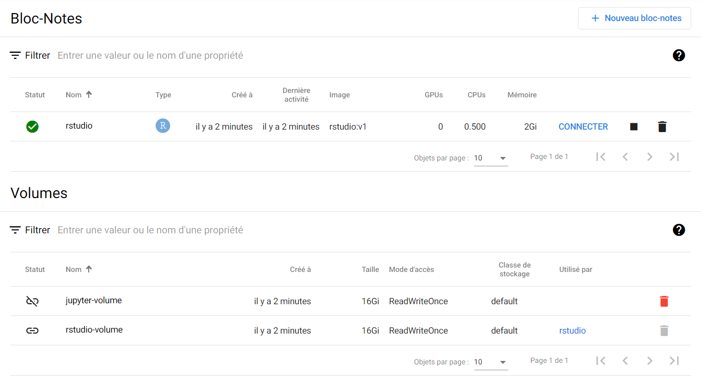

# Aperçu

Les disques sont les systèmes de fichiers familiers de type disque dur auxquels
vous êtes habitué, fournis à vous des disques SSD rapides !

# Installation

Lors de la création de votre serveur bloc-notes, vous demandez des disques en
ajoutant des volumes de données à votre serveur de bloc-notes (illustré
ci-dessous, avec `Type = New`). Ils sont automatiquement monté dans le
répertoire (`Mount Point`) que vous choisissez, et sert de simple et moyen
fiable de conserver les données attachées à un serveur de bloc-notes .

<!--prettier-ignore-->
??? avertissement "Vous payez pour tous les disques que vous possédez, qu'ils soient connectés à un serveur bloc-note ou non"
    Dès que vous créez un disque, vous le [payez](#prix) jusqu'à ce qu'il soit [supprimé](#suppression-du-stockage-sur-disque), même si le Serveur de blocs-note  d'origine est supprimé. Voir [Suppression du stockage sur disque](#suppression-du-stockage-sur-disque) pour plus d'informations

# Une fois que vous avez les bases...

Lorsque vous supprimez votre Serveur blocs-note , vos disques **ne sont pas
supprimés**. Cela laisse vous réutilisez ce même disque (avec tout son contenu)
sur un nouveau Serveur blocs-note plus tard (comme indiqué ci-dessus avec « Type
= existant » et le « Nom » défini sur le volume que vous voulez réutiliser). Si
vous avez terminé avec le disque et son contenu,
[ supprimez-le](#suppression-du-stockage-sur-disque).

## Suppression du stockage sur disque

Pour voir vos disques, consultez la section Volumes blocs-note de Serveur
blocs-note page (ci-dessous). Vous pouvez supprimer n'importe quel disque non
connecté (icône orange à gauche) en cliquant sur l'icône de la corbeille.

## Prix

<!--prettier-ignore-->
??? info "Les modèles de tarification sont provisoires et peuvent changer"
    Au moment de la rédaction, la tarification est couverte par la plate-forme pour les utilisateurs initiaux. Ce guide explique comment les choses devraient être tarifées à l'avenir, mais cela peut changer.

Lors du montage d'un disque, vous obtenez un
[Disque managé Azure](https://azure.microsoft.com/en-us/pricing/details/managed-disks/).
La tarification **Disques gérés SSD Premium** indique le coût par disque en
fonction de la taille. Notez que vous payez pour la taille de disque demandée,
et non pour la quantité d'espace que vous utilisent actuellement.

<!--prettier-ignore-->
??? info "Conseils pour minimiser les coûts"
    Comme les disques peuvent être attachés à un Serveur blocs-note  et réutilisés, un modèle d'utilisation typique pourrait être :

    * À 9h, créez un Serveur blocs-note  (demandez 2CPU/8GB RAM et un 32GB attaché
      disque)
    * Travaillez tout au long de la journée, en enregistrant les résultats sur le disque attaché
    * À 17h, éteignez votre Serveur blocs-note  pour éviter de le payer du jour au lendemain
    * REMARQUE : Le disque attaché ** n'est pas détruit ** par cette action
    * À 9 heures du matin le lendemain, créez un nouveau serveur blocs-note et ** joignez     votre disque**
    * Continuez votre travail...

    Cela protège tout votre travail sans payer pour l'ordinateur lorsque vous ne l'utilisez pas
